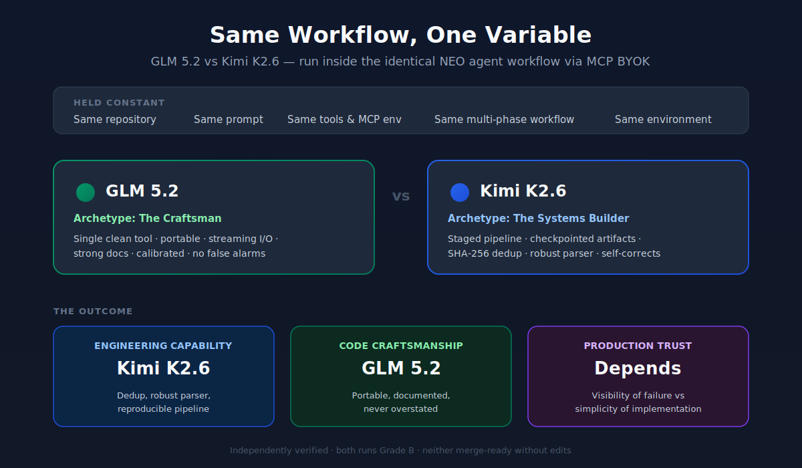
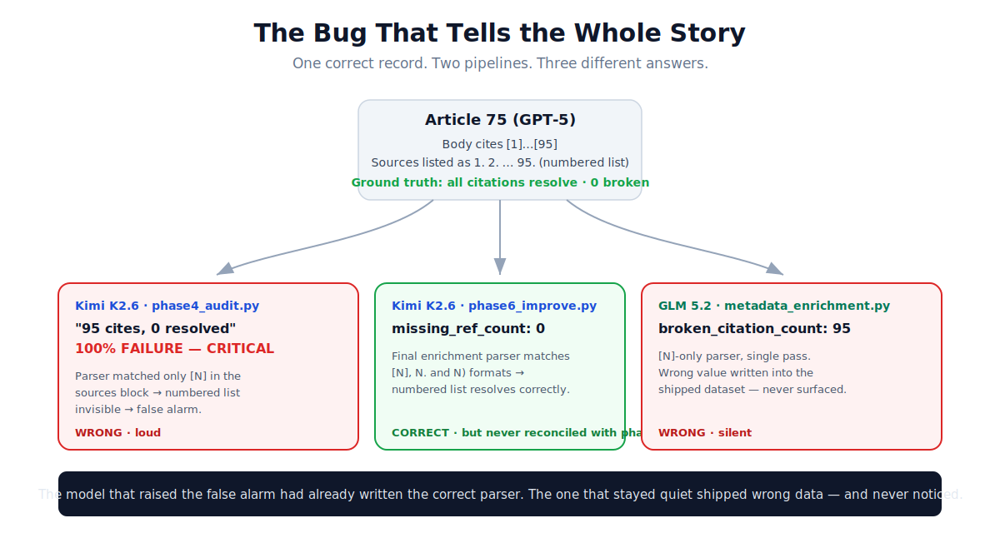
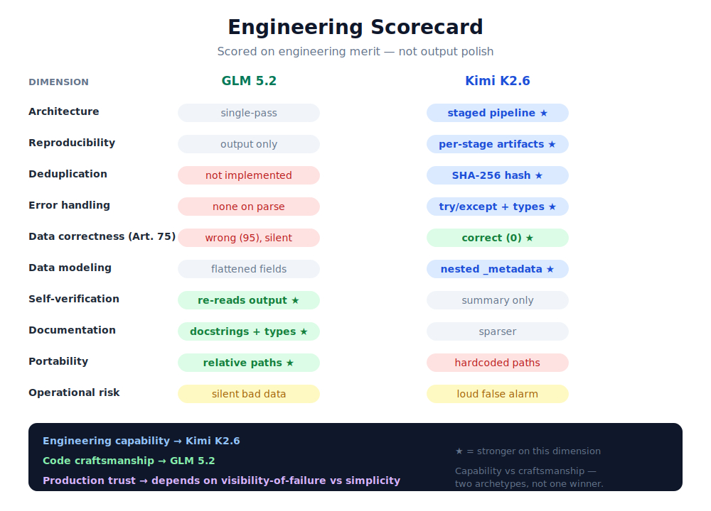

# Two Models, One Workflow, and the Same Wrong Answer

### What an identical agent task taught us about evaluating AI systems by their process, not their output

*Independent third-party evaluation · June 2026 · ~12 min read*



---

In a benchmark dataset for an open-source research agent, one report — call it Article 75 — cites 95 sources correctly. The body marks claims `[1]`–`[95]`; the Sources section lists all 95 as a numbered list (`1.`, `2.`, … `95.`). Every citation resolves. A human would call it well-sourced.

Two frontier language models audited this dataset inside the exact same engineering workflow. Here is what each concluded about Article 75:

- One pipeline reported: **"95 citations, 0 resolved, 100% citation failure — CRITICAL."**
- The other silently recorded **`broken_citation_count: 95`** and said nothing.

Both were wrong about the same correct record — one loudly, one silently. And from the outside, **both runs looked like complete successes**: all deliverables produced, working code, polished reports. Review either one the way most teams review AI output — skim the summary, confirm the files exist, move on — and you'd have shipped a wrong number without knowing it was there.

How can two successful-looking outputs both be wrong about the same simple thing? That question turned out to be more valuable than naming a winner.

## The setup

Both models ran inside the **NEO VS Code extension**, driven through NEO's **MCP BYOK** (bring-your-own-key) integration. That's the whole foundation of the experiment: BYOK let us hold *everything* constant and swap *only* the model behind the key.

- Same repository (`langchain-ai/open_deep_research`, a LangGraph research agent)
- Same prompt and problem statement
- Same tools and MCP environment
- Same multi-phase workflow
- **Only the underlying model changed** — **GLM 5.2** in one run, **Kimi K2.6** in the other

NEO is the evaluation platform here, not a contestant — the wind tunnel in which you change one airfoil and trust that nothing else moved. The task was a genuine data-engineering assignment: inventory the agent's benchmark datasets, audit their integrity, deduplicate, enrich with quality metadata, score for hallucination and traceability risk, then adversarially review the work and prove every claim. Real pipelines, real artifacts, real code.

One honest bound before we start: this is **one task and one run per model**, so read what follows as a deep qualitative comparison, not a leaderboard. Every number below was independently recomputed from the raw artifacts rather than taken from either model's own report — you can reproduce the central one yourself with [`verify_article_75.py`](verify_article_75.py).

---

## The outcome, up front

You don't need 3,000 words to know how this ended. Here it is before the analysis:

| Dimension | GLM 5.2 | Kimi K2.6 |
|---|---|---|
| Architecture | Single-pass tool | **Staged pipeline** |
| Reproducibility | Final output only | **Per-stage artifacts persisted** |
| Deduplication | Not implemented | **SHA-256 content hash** |
| Error handling | None around `json.loads` | **try/except + type checks** |
| Data correctness (Article 75) | Wrong (`95`), silent | **Correct (`0`)** in final data |
| Self-verification | **Re-reads its own output** | Summary only |
| Portability | **Relative paths** | Hardcoded absolute paths |
| **Final winner** | Code craftsmanship | **Engineering capability** |

Kimi built the more capable system; GLM wrote the cleaner artifact. Neither is production-ready as-is. The rest of this article is *why* that split happened — and why the process-level differences it reveals matter far more than the scoreline.

## One record, three answers



Return to Article 75, because it is the thread that runs through everything else.

Re-run both models' pipelines against that one record and here is what they actually recorded:

```text
Article 75 (GPT-5) — a correctly-sourced report, 95 references as a numbered list
─────────────────────────────────────────────────────────────────────────────────
Kimi K2.6 · phase4_audit.py      →  citations=95  resolved=0  verdict="100% FAILURE (CRITICAL)"   [WRONG / loud]
Kimi K2.6 · phase6_improve.py    →  missing_ref_count=0                                            [CORRECT]
GLM 5.2   · metadata_enrichment  →  broken_citation_count=95                                       [WRONG / silent]
```

Three data points, and every one is an engineering signal.

The root cause is the same in both wrong cases: a citation-resolution parser that only understands bracketed references. Both models, at least somewhere in their pipeline, searched the Sources section for `[1]`, `[2]`, and so on. Article 75's sources are a numbered list — `1.`, `2.` — so the bracket search matched nothing, and "no bracketed sources found" was silently treated as "no sources resolve."

But watch how the two pipelines diverge from that shared mistake, because the divergence is the entire story:

**Kimi made the error, then fixed it in code — but shipped the wrong version anyway.** Its early `phase4` stage used the weak `[N]`-only parser and produced the catastrophic "100% failure." By its final `phase6` stage, Kimi had written a better parser — one that matches three source formats:

```python
m = re.match(r"^\s*(?:\[(\d+)\]|(\d+)[\.\)])", line.strip())
```

That parser reads numbered lists correctly, which is why Kimi's *final dataset* records `missing_ref_count: 0` for Article 75. The correct answer was sitting in Kimi's own output. But the alarming `phase4` number — generated by an earlier, worse version of the same logic — was never reconciled against the corrected `phase6` data before the executive summary was written. The pipeline contained both the right answer and the wrong answer, and shipped the wrong one to the top of the report.

**GLM made the error and never noticed.** Its single-pass enrichment script used the `[N]`-only parser throughout, so it stored `broken_citation_count: 95` in its final delivered dataset — and because GLM never built a stage to inspect or recompute that value, no human ever saw it surface as a finding. The wrong number is simply sitting in the shipped data, quiet, waiting for some downstream consumer to trust it.

This inverts the conclusion you'd reach from the reports alone. The model that raised the false alarm had already written the correct parser and stored the correct answer. The model that stayed reassuringly quiet shipped incorrect data and got away with it precisely *because* it never looked closely. One has a reporting bug on top of correct data. The other has a data bug hidden by the absence of inspection.

Silence is not correctness.

Hold onto that distinction — loud-wrong versus silent-wrong. It reappears in validation, in recovery, in pipeline design, and in what each failure costs in production.

---

## Two engineering archetypes

This wasn't a contest of intelligence. It was a contest of engineering temperament.

It would be easy, and wrong, to turn this into "Kimi beat GLM" or the reverse. The scores were close, both runs earned a passing grade, and neither produced code you'd merge without edits. What's interesting is that the two models embody two recognizable engineering archetypes — the kind you'll find on any real team — and the Article 75 incident is exactly what each archetype's strengths and blind spots look like in practice.

### Archetype A — The Systems Builder (Kimi K2.6)

Kimi approached the task like someone building a data platform. It decomposed the work into discrete, instrumented stages — `phase3_audit.py`, `phase4_audit.py`, `phase6_improve.py` — and each stage persisted its output as JSON before anything downstream consumed it. `phase3_results.json` and `phase4_results.json` exist on disk. This is the canonical shape of a real pipeline: compute, checkpoint, render.

The systems-thinking shows in the substance:

- **It implemented deduplication rather than asserting it.** `phase6` content-addresses every record with a SHA-256 hash of `prompt + article` and removes collisions. The task asked for dedup; Kimi wrote the dedup.
- **It modeled data non-destructively.** All 15 new fields are nested under a single `_metadata` key, leaving the original `{id, prompt, article}` records pristine and diffable.
- **It validated inputs defensively.** `phase3` wraps every `json.loads` in try/except, captures parse failures as structured records, and checks both key presence and types.
- **It built richer instrumentation.** Composite `hallucination_risk_score` and `source_traceability_score`, year-filtering (1900–2035) to avoid flagging dates as suspicious figures, counterargument and vague-language signals.
- **It self-corrected.** When Kimi noticed its Phase 4 estimates were drawn from a 7-record sample, it recomputed over the full population and reported that its own earlier numbers had been off by 85–140% — in writing.

The blind spots are the shadow of those strengths. More stages mean more seams, and Kimi's worst output came from an *unreconciled seam*: a weak early stage and a correct late stage that never compared notes. It also hardcoded absolute paths (`/home/azureuser/ModelsEval/kimi/...`), so the pipeline isn't portable, and left a dead `import random` lying around. Complex systems have more places for a loose bolt to hide.

### Archetype B — The Craftsman (GLM 5.2)

GLM approached the same task like a careful library author writing one clean tool. It produced a single enrichment program and wrote it the way you'd want a utility written:

- **It's portable.** Paths derive from `os.path.dirname(__file__)`, so the script runs wherever the repo lives — the difference between code that works on your machine and code that works.
- **It streams.** Input is read and output written line by line, so memory stays flat regardless of file size. Kimi loads whole files into lists.
- **It reads like documentation.** A complete module docstring enumerates every field; logic is decomposed into small, single-responsibility, type-hinted pure functions; and `main()` ends by re-reading its own output to verify what it wrote.
- **It stayed calibrated.** Across its entire report, GLM raised no false alarms. It even flagged, in its own adversarial review, that citation "breakage" might be a formatting mismatch rather than a real failure — the exact confound behind Article 75.

And GLM's blind spots are the shadow of *its* strengths. Simplicity bought cleanliness at the cost of capability: it never implemented the deduplication the task asked for (it asserted "zero duplicates" from inline analysis instead), it used the weaker parser, it flattened 14 fields into each record's top level, and it had no error handling around `json.loads` — a single malformed line would crash the run. A single-pass tool has no stage that re-examines its own work, which is exactly why GLM's wrong `95` for Article 75 went unnoticed.

**The tradeoff, stated plainly:** The Systems Builder gives you capability, instrumentation, and recoverability — at the cost of operational complexity and more seams to get wrong. The Craftsman gives you simplicity, portability, and readability — at the cost of capability and self-inspection. Neither is universally correct. You want the Systems Builder when the task is a pipeline that will run repeatedly, evolve, and need debugging. You want the Craftsman when the task is a self-contained utility that must be correct, portable, and legible at a glance. The mistake is hiring one when you needed the other.

---

## What benchmarks don't see

Here is the uncomfortable thing about Article 75: **no standard benchmark would have caught it.**

Most AI evaluation measures final answers. Did the model produce the right output? Did it pass or fail? What's the accuracy on a held-out set? Those questions are tractable and gradeable, which is why benchmarks favor them. They are also the wrong questions for agentic engineering work, and Article 75 is the proof.

Consider what a conventional evaluation would have seen from these two runs:

- **Both produced all required deliverables.** Pass.
- **Both ran real code that executed without crashing.** Pass.
- **Both generated coherent, well-structured reports.** Pass.
- **Neither fabricated files or invented executions.** Pass.

By every output-level metric, both runs succeed. The wrong number in GLM's dataset is invisible to a pass/fail check because nothing in the output *announces* it. Kimi's false "CRITICAL" would, at worst, look like diligence — a model finding problems. A leaderboard would rank these two as roughly equivalent successes and surface none of what actually separated them.

What real engineering workflows actually require you to evaluate is the layer benchmarks throw away:

- **Intermediate artifacts.** Kimi's mistake was diagnosable *only* because it persisted `phase4_results.json` and `phase6` output separately. The discrepancy lives between stages. An output-only evaluation never sees the stages.
- **Validation logic.** Does the pipeline check its inputs? Kimi's type-checked, try/except parsing versus GLM's unguarded `json.loads` is invisible until a malformed record arrives — at which point one degrades and the other crashes.
- **Error handling and recovery.** What happens when an assumption is violated? The numbered-list source format is exactly such a violation, and it's where both parsers quietly failed.
- **Traceability and provenance.** Can you reconstruct *why* a number is what it is? Kimi's checkpoints make this possible; GLM's inline computation does not.
- **Pipeline architecture.** The shape of the system determines its failure modes. A multi-stage pipeline can self-correct but can also ship unreconciled stages. A single-pass tool can't contradict itself but also can't catch itself.

The lesson is not that benchmarks are useless. It's that **output-level evaluation is necessary and radically insufficient for agents.** The most consequential differences between these two models were entirely in the process — the artifacts, the validation, the architecture — and process is exactly what a final-answer benchmark is designed to ignore.

---

## In production, this costs you

In a benchmark, a wrong number is a footnote. In production, it's an incident.

Move these two runs out of a benchmark and into a real engineering pipeline, where their outputs feed a dashboard, a quality gate, or a downstream model. Now the differences have costs.

**GLM's silent wrong data (`broken_citation_count: 95` on a clean article).**
- *User impact:* A downstream consumer — a quality dashboard, a model trainer, a filtering step — ingests `95` as truth and treats a perfectly-sourced report as catastrophically broken. The article might be suppressed, down-weighted, or flagged for rework that isn't needed.
- *Operational impact:* The error propagates silently. Because nothing surfaced it, there's no alert, no log line, no signal. It is discovered, if ever, only when someone notices a metric that doesn't match reality and goes digging.
- *Investigation cost:* High and delayed. Silent data corruption is the most expensive class of bug precisely because the clock doesn't start until long after the damage is done.
- *Risk level:* **High.** Invisible, trusted, and load-bearing.

**Kimi's false alarm ("100% citation failure — CRITICAL").**
- *User impact:* An on-call engineer is paged, or a release is gated, over a report that is actually fine. Attention is spent; trust is dented.
- *Operational impact:* The failure is loud and immediate, which is paradoxically the *better* failure mode — it announces itself and gets triaged within minutes, resolving to "the sources were a numbered list."
- *Investigation cost:* Real but bounded. The artifact trail (`phase4` vs `phase6`) makes the discrepancy diagnosable quickly.
- *Risk level:* **Medium**, and corrosive if repeated — a system that cries wolf gets muted, and a muted alarm misses the real fire.

**The capability gaps would have surfaced too.** GLM's missing deduplication means duplicate records pass through unremoved if any exist; its unguarded parsing means one corrupt line halts the entire job. Kimi's hardcoded paths mean the pipeline breaks the moment it's deployed anywhere but the machine it was written on. Each of these is a routine production incident waiting for the right input.

The throughline: **a passing benchmark score would have masked every one of these.** The cost of each isn't in the output you can see; it's in the process you have to inspect.

---

## The decisions that mattered

It's worth slowing down on the specific engineering decisions, because each one is a generalizable lesson, not a quirk of this task.

**Validation architecture.** Kimi validates types and structure at ingestion; GLM trusts its input. This is the difference between a pipeline that *degrades* on bad data and one that *crashes*. In a batch job processing hundreds of records, "skip and log the malformed line" versus "abort the run on line 200" is the difference between a partial result you can act on and a wasted night. Validation isn't ceremony — it's what determines your failure granularity.

**Deduplication strategy.** Kimi's SHA-256 content hashing is the correct primitive: stable, collision-resistant, and order-independent. It means dedup is *reproducible* — run it twice, get the same result — and *auditable*. GLM skipping it entirely means the guarantee simply doesn't exist; "we found no duplicates" is an observation, not a property of the pipeline. When data quality is the deliverable, the difference between an asserted result and an enforced invariant is the whole job.

**Provenance tracking.** Kimi stamps each record with model name, source file, a content hash, and a timestamp, nested cleanly under `_metadata`. GLM adds provenance too, but flattened into the record root, co-mingling it with payload. The nesting matters more than it looks: it keeps the original schema diffable and makes it trivial to strip enrichment back out. Provenance you can't cleanly separate from data is provenance you'll eventually corrupt.

**Citation handling.** This is the crux of Article 75. A parser that handles one source format is a parser that will be wrong the first time it meets a second format — and real-world data always contains a second format. Kimi's three-format matcher (`[N]`, `N.`, `N)`) is more robust not because it's cleverer but because it made fewer assumptions about the world. The gap between a smart plan and a correct result, in agentic data work, is almost always this kind of unglamorous parsing detail.

**Recovery and self-correction.** Kimi's recomputation of its biased 7-record sample is the single most valuable behavior in either run — an agent noticing its own method was unsound and fixing it. But the Article 75 reconciliation failure shows recovery is only as good as the gate that enforces it: Kimi *had* the corrected data and still shipped the stale claim, because nothing required the two stages to agree before a conclusion was drawn. Self-correction without a reconciliation gate is a fix that doesn't land. GLM, with no stage to correct *from*, didn't self-correct at all — its calibrated prose was caution, not recovery.

The meta-lesson across all five: these are properties of *process design*, and not one of them is visible in the final answer.

---

## The scorecard



A category-by-category read, scored on engineering merit rather than output polish. "Tie" and "Neither" are used where they're honest — the goal is an accurate map, not a clean winner.

| Category | Winner | Why |
|---|---|---|
| Architecture | Kimi K2.6 | Staged, checkpointed pipeline vs single pass |
| Validation | Kimi K2.6 | Type/structure checks and guarded parsing |
| Error Recovery | Kimi K2.6 | Self-corrected its sampling bias in writing |
| Data Modeling | Kimi K2.6 | Non-destructive `_metadata`, content hashing |
| Traceability | Kimi K2.6 | Persisted intermediate artifacts per stage |
| Maintainability | GLM 5.2 | One legible, well-documented, portable tool |
| Simplicity | GLM 5.2 | Lower operational complexity, fewer seams |
| Documentation | GLM 5.2 | Full docstrings, type hints, self-verification |
| Operational Risk | Tie | Silent bad data (GLM) vs loud false alarm (Kimi) — different hazards |
| Production Readiness | Neither | Both require edits before merge |

The one-line read: Kimi is ahead on capability, GLM on craftsmanship, and neither is production-ready without edits. The full three-way verdict is below — first, why those category calls land the way they do.

---

## Four rules for shipping agents

If you're putting agents into real engineering workflows, translate the above into four operating rules. Each maps directly to something Article 75 exposed.

- **Assume silent failures, and design to surface them.** GLM's wrong `95` shipped because nothing inspected it. The most dangerous agent output isn't the one that errors loudly — it's the plausible, well-formatted value that's quietly wrong. Treat un-inspected numbers as unverified by default, and prefer agents that make their mistakes visible over agents that make them disappear.
- **Add reconciliation gates between stages.** Kimi's pipeline held both the right answer and the wrong one and shipped the wrong one, because no check forced its stages to agree. When the same metric is computed in more than one place, make agreement a hard precondition before any conclusion is drawn. A correction that isn't enforced is a correction that doesn't land.
- **Require artifact persistence.** We could diagnose Kimi's failure only because it wrote `phase4_results.json` and `phase6` output separately; we could catch GLM's only by re-running its parser. Mandate that agents persist intermediate artifacts, not just final deliverables. A claim with no reproducible computation behind it is a hypothesis with a number attached.
- **Evaluate the process, not just the output.** Both runs pass every output-level check. The differences that would have caused production incidents live in validation, recovery, architecture, and provenance — none of which a final-answer review touches. Build your acceptance criteria around the pipeline, not the summary.

These aren't model-selection rules; they're harness rules. They apply no matter which model is behind the key, and they're what turn an impressive-looking agent run into one you can actually trust in production.

---

## The verdict

> **Engineering Capability Winner — Kimi K2.6.** The more capable system: real deduplication, robust multi-format parsing, a reproducible staged pipeline, richer metrics, and a final dataset that is actually correct on Article 75.
>
> **Code Craftsmanship Winner — GLM 5.2.** The cleaner artifact: portable, memory-efficient, well-documented, and calibrated enough to never raise a false alarm.
>
> **Production Trust Winner — Depends.** It comes down to what you value more: *visibility of failure* (Kimi makes mistakes loud and diagnosable) or *simplicity of implementation* (GLM is smaller, cleaner, and easier to reason about — but inspects itself less). Choose deliberately; the two are not the same bet.

---

## How this ran on NEO

This comparison was only clean because the harness never moved.

Both runs executed inside the **NEO VS Code extension** (it also ships for Cursor). NEO drove the full agentic loop — planning the nine phases, reading the repository, writing and running the audit scripts, and producing the deliverables — through its **MCP BYOK** integration. BYOK means *bring your own key*: you point NEO at whatever model you want, and the entire workflow runs against that model unchanged.

That's what made this an experiment instead of an anecdote. Same orchestration, same tools, same prompts, same environment. The only thing that differed between the two runs was the key behind the model. Every divergence you just read about is therefore attributable to one variable — not to prompt luck, tool differences, or setup drift.

NEO was the lab. GLM 5.2 and Kimi K2.6 were the only thing on the bench.

## Run your own comparison

The most useful thing about this setup is that you can reproduce it.

Install NEO, plug in a key via BYOK, hand it a real task in your own repository, and swap models between runs. Then do what we did: don't just read the final report — open the intermediate artifacts, re-run the scripts, and recompute the numbers. The gap between models shows up in the process, and the process is right there on disk.

[](https://marketplace.visualstudio.com/items?itemName=NeoResearchInc.heyneo)
[](https://marketplace.cursorapi.com/items/?itemName=NeoResearchInc.heyneo)
[](https://heyneo.com)

---

## The real lesson

The most important finding was not which model won. It's that **both outputs looked successful, both would have passed a superficial review, and the differences that mattered only appeared when we inspected the process and the artifacts.**

GLM's wrong number was invisible until we re-ran its parser. Kimi's correct answer was buried under its own stale headline until we compared its stages. Neither truth is reachable from the summary, the file listing, or the pass/fail signal. They are reachable only by treating the *process* — the validation, the intermediate artifacts, the architecture, the reconciliation logic — as a first-class object of evaluation.

This is the shift that matters as AI agents move into production engineering. For a chatbot, evaluating the final answer is enough. For an agent that writes pipelines, audits data, and ships artifacts other systems depend on, the final answer is the *least* informative thing it produces. Two agents can hand you outputs that look equally finished and equally correct, and be wrong in opposite, invisible ways — one loudly, one silently — for reasons that live entirely in how the work was done.

So the concrete takeaway is this: **if you're evaluating agents, require intermediate artifacts, independent recomputation of every metric, and reconciliation checks between stages. Otherwise both of these runs would have looked successful** — and one of them would have shipped a wrong number into your data while the other paged you about a problem that wasn't there. Article 75 is a small bug in a benchmark dataset. It's also a preview of the only evaluation question that will matter as agents move into production: not "is the answer right?" but "can I tell when it's wrong?"

---

*The full audit — every category score, the hallucination analysis, and the verified evidence behind each claim — is in [`report.md`](report.md). The one-command reproduction is [`verify_article_75.py`](verify_article_75.py). This is one task and one run per model: a deep qualitative comparison, not a leaderboard.*
